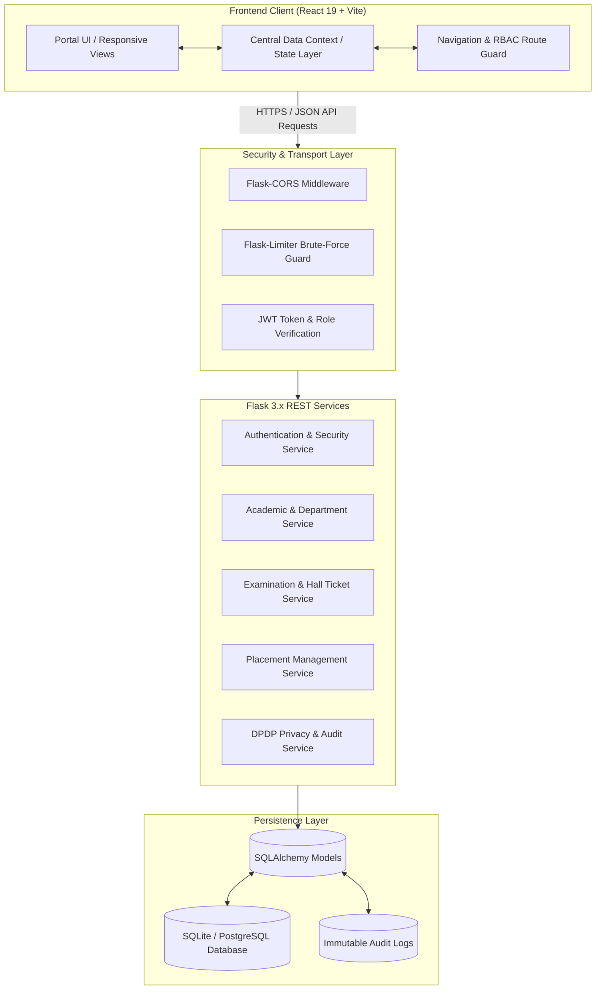

# CollegeConnect

> **A Secure and Privacy-Aware Student Data Management System Based on DPDP Principles**

[](https://react.dev/)
[](https://vitejs.dev/)
[](https://tailwindcss.com/)
[](https://flask.palletsprojects.com/)
[](https://en.wikipedia.org/wiki/Argon2)
[](https://pytest.org/)
[](https://www.meity.gov.in/)

---

## 📖 Table of Contents

- [1. Project Title and Introduction](#1-project-title-and-introduction)
- [2. Problem Statement](#2-problem-statement)
- [3. Project Objectives](#3-project-objectives)
- [4. Key Features](#4-key-features)
- [5. User Roles and Responsibilities](#5-user-roles-and-responsibilities)
- [6. Technology Stack](#6-technology-stack)
- [7. System Architecture](#7-system-architecture)
- [8. Role-Based Authentication and Authorization](#8-role-based-authentication-and-authorization)
- [9. Data Privacy and Security Features](#9-data-privacy-and-security-features)
- [10. Project Folder Structure](#10-project-folder-structure)
- [11. Installation and Local Setup](#11-installation-and-local-setup)
- [12. Environment Configuration](#12-environment-configuration)
- [13. How to Run Frontend and Backend](#13-how-to-run-frontend-and-backend)
- [14. Demo Credentials](#14-demo-credentials)
- [15. Screenshots](#15-screenshots)
- [16. Automated Testing & Verification](#16-automated-testing--verification)
- [17. Limitations](#17-limitations)
- [18. Future Enhancements](#18-future-enhancements)
- [19. Author and Acknowledgement](#19-author-and-acknowledgement)

---

## 1. Project Title and Introduction

**CollegeConnect: A Secure and Privacy-Aware Student Data Management System Based on DPDP Principles**

**CollegeConnect** is an integrated, multi-tenant academic management platform engineered to modernize campus administration while embedding fundamental principles from India's **Digital Personal Data Protection (DPDP) Act, 2023**. Designed for colleges and universities, the platform consolidates student records, department governance, curriculum tracking, examination workflows, and campus placement drives into a unified, privacy-first software system.

The application replaces fragmented, insecure spreadsheets and disjointed legacy portals with strict **Role-Based Access Control (RBAC)**, department-level data boundaries, student consent lifecycle management, cryptographic hall ticket verification, and immutable access auditing.

> **Disclaimer:** CollegeConnect is an academic engineering capstone project demonstrating practical technical controls and architectural patterns inspired by the DPDP Act. It does not claim formal legal certification under the DPDP Act or statutory regulatory bodies.

---

## 2. Problem Statement

Conventional higher education data management systems suffer from critical privacy, security, and administrative limitations:

1. **Unrestricted Internal Data Exposure:** Administrative personnel and faculty often have indiscriminate access to sensitive student personal identifying information (PII), including residential addresses, guardian contact numbers, and medical details.
2. **Lack of Purpose Limitation:** Student records shared with external placement recruitment partners or internal clubs frequently lack consent management and data minimization controls.
3. **No Mechanism for Data Correction (DPDP Right to Correction):** Students lack a structured, auditable digital workflow to review their profile records and request corrections.
4. **Vulnerability to Examination Forgery:** Traditional paper or unverified digital hall tickets and scorecards are prone to unauthorized modification and counterfeit creation.
5. **Absence of Immutable Audit Logging:** Actions involving sensitive record retrieval, grade modifications, or administrative changes are rarely tracked with cryptographic integrity or access history.

---

## 3. Project Objectives

- **Implement Privacy-by-Design:** Enforce strict data minimization, purpose limitation, and consent mechanisms across student profiles.
- **Architect Robust RBAC & Department Boundaries:** Prevent cross-department data leakage between academic branches (e.g., Computer Engineering vs. Information Technology).
- **Secure Authentication Lifecycle:** Enforce institutional email validation, high-work-factor password hashing using **Argon2id**, single-use verification tokens, and JWT session handling.
- **Deliver Cryptographically Verifiable Examination Credentials:** Generate tamper-evident digital hall tickets stamped with SHA-256 cryptographic fingerprints.
- **Enable Student Right to Data Correction:** Implement a structured request-and-approval pipeline for demographic and academic updates with full reviewer audit logs.
- **Ensure Responsive Accessibility:** Deliver a responsive, mobile-friendly interface featuring a collapsible navigation drawer across desktop, tablet, and mobile viewports.

---

## 4. Key Features

- 🛡️ **Role-Based Portals:** 6 tailored portals for Super Admin, Academic Admin, Examination Admin, Placement Admin, Class Teacher, and Student.
- 🔐 **Privacy Center & Consent Management:** Dedicated interface for students to review active data processing notices, purpose scopes, and granted consents.
- 📝 **Student Request & Correction Pipeline:** Full lifecycle tracking for Attendance Corrections, Bonafide Certificates, Profile Updates, and Marks Clarifications.
- 🎫 **Digital Hall Ticket Verification:** SHA-256 fingerprint verification and downloadable, cryptographically signed examination admit cards.
- 💼 **Purpose-Limited Campus Placement Management:** Recruiter and drive management with eligibility filters, dynamic student applications, and offer tracking.
- 📊 **Academic Records & Performance Analytics:** Real-time GPA/CGPA tracking, internal continuous assessment marks, subject-wise attendance metrics, and division rosters.
- 🔍 **Immutable Access History & Audit Trail:** Comprehensive logging of data access events, user sign-ins, profile edits, and administrative overrides.
- 📬 **Dev Outbox Simulator:** Built-in email capture interface enabling complete verification and password reset workflows during local development without live SMTP configuration.
- 📱 **Fully Responsive Layout:** Slide-in navigation drawer for tablet (768px–1023px) and mobile (<768px) with zero horizontal overflow.

---

## 5. User Roles and Responsibilities

```
+-----------------------------------------------------------------------------------+
|                               COLLEGECONNECT ROLES                                |
+-----------------------------------------------------------------------------------+
|  [Super Admin]         -> Global institutional governance & admin provisioning    |
|  [Academic Admin]      -> Branch curriculum, class divisions, faculty & students  |
|  [Examination Admin]   -> Exam timetables, hall tickets, internal marks & results  |
|  [Placement Admin]     -> Company drives, student applications & job offers       |
|  [Class Teacher]       -> Daily attendance, division students & request reviews   |
|  [Student]             -> Personal profile, academic history & DPDP Privacy Center|
+-----------------------------------------------------------------------------------+
```

### 1. Super Admin (Institution Authority)
- Manages overall college infrastructure, departments, academic years, and system configuration.
- Provisions and manages Department Administrator accounts.
- Inspects institution-wide security settings and global audit logs.
- *Primary Demo Identity:* **Kartik Bhegade**

### 2. Academic Department Admin
- Scoped strictly to an assigned department (e.g., Computer Engineering).
- Manages class divisions (SE, TE, BE), subject curriculum, and student rosters.
- Assigns Class Teachers and subject faculty to respective divisions.
- Reviews and approves student profile updates and data correction requests.
- *Primary Demo Identity:* **Prof. Kirti Borhade**

### 3. Examination Department Admin
- Schedules semester and unit test examination timetables.
- Generates tamper-proof digital hall tickets with cryptographic verification codes.
- Moderates internal assessment marks and publishes final results gazettes.
- *Primary Demo Identity:* **Prof. Akash Mhetre**

### 4. Placement Department Admin (TPO)
- Manages campus recruiting partner companies, job listings, and placement drives.
- Applies CGPA and department eligibility filters to student candidate pools.
- Tracks student job applications, interview rounds, and rolling offer releases.
- *Primary Demo Identity:* **Prof. Satyajit Sirsat**

### 5. Class Teacher (Faculty)
- Manages assigned class division (e.g., TE Computer Engineering – Div A).
- Records daily session attendance with real-time percentage computations.
- Evaluates continuous internal assessments and practical coursework.
- Reviews student attendance correction requests and medical leave submissions.
- *Primary Demo Identity:* **Prof. Sonal Kadam**

### 6. Student
- Accesses authenticated dashboard, semester course curriculum, and attendance statistics.
- Downloads cryptographically stamped examination hall tickets and scorecards.
- Applies to eligible campus placement recruitment drives and tracks status.
- Manages personal privacy consents and submits official correction requests via the **Privacy Center**.
- *Primary Demo Identity:* **Krushna Funde** (PRN: `22CE001`)

---

## 6. Technology Stack

### Frontend Architecture
| Technology | Version | Purpose |
| :--- | :--- | :--- |
| **React** | `19.2.8` | Component-based interactive user interface |
| **Vite** | `8.3.0` | High-performance build tool and local development server |
| **Tailwind CSS** | `v4.3.3` | Modern utility-first responsive styling framework |
| **Lucide React** | `^1.51.0` | Accessible iconography system |
| **Context API** | Native | Centralized reactive state and data sharing layer |

### Backend Architecture
| Technology | Version | Purpose |
| :--- | :--- | :--- |
| **Python** | `3.11+ / 3.14` | Core programming runtime |
| **Flask** | `3.x` | Lightweight WSGI web application framework |
| **Flask-SQLAlchemy** | `3.1.x` | Object Relational Mapper (ORM) for relational database models |
| **Flask-Migrate** | `4.0.x` | Database schema migrations via Alembic |
| **Flask-CORS** | `4.0.x` | Cross-Origin Resource Sharing middleware |
| **Flask-Limiter** | `3.5.x` | Rate limiting for brute-force protection |
| **Argon2-cffi** | `23.1.x` | Memory-hard password hashing algorithm |
| **PyJWT** | `2.8.x` | Stateless JSON Web Token generation and validation |
| **Pytest** | `8.0.x` | Automated end-to-end and security testing suite |
| **Database** | SQLite / Postgres | Relational data persistence engine |

---

## 7. System Architecture

CollegeConnect follows a decoupled **Client-Server Architecture** with a RESTful API backend and a single-page React frontend.



---

## 8. Role-Based Authentication and Authorization

### 1. Mandatory Institutional Email Login
- Users must authenticate strictly using their registered institutional email (`username@college.edu`).
- Student PRN / Roll Number is preserved as a demographic identifier and cannot be used as an authentication credential.
- Accounts are provisioned exclusively by authorized administrators; public self-registration is disallowed.

### 2. Argon2id Password Hashing
Passwords are cryptographic hashes created with **Argon2id** (memory-hard, resistant to GPU/ASIC cracking):
- Time Cost: `3`
- Memory Cost: `64 MB (65,536 KB)`
- Parallelism: `4`

### 3. Department & Class Level Data Isolation
- **Department Boundary:** An Academic Admin for Computer Engineering cannot query or modify data belonging to Information Technology.
- **Class Boundary:** Class Teachers have access restricted to students in their assigned division.
- **Student Boundary (IDOR Prevention):** Student queries enforce authorization checks against the caller's JWT `sub` identifier.

### 4. Account Lifecycle & Activation
- Newly provisioned accounts start in `pending_verification` status.
- Single-use, cryptographically random activation tokens (hashed with SHA-256 in the database) are dispatched via email.
- Accounts must be activated before protected routes can be accessed.

---

## 9. Data Privacy and Security Features

```
+-----------------------------------------------------------------------------------+
|                        DPDP PRINCIPLES IN COLLEGECONNECT                          |
+-----------------------------------------------------------------------------------+
| 1. Notice & Transparency   -> Digital Institutional Privacy Notice (Versioned)    |
| 2. Purpose Limitation      -> Data accessed strictly for academic & TPO workflows |
| 3. Data Minimization       -> PII masking for contacts and residential addresses  |
| 4. Right to Correction     -> Student correction requests with admin audit review |
| 5. Storage Limitation      -> Defined data retention policies                     |
| 6. Integrity & Security    -> Argon2id hashing, SHA-256 tokens, and rate limiting |
| 7. Auditability            -> Tamper-evident activity logs across all modules     |
+-----------------------------------------------------------------------------------+
```

- **Masked Sensitive Contact Data:** Phone numbers and emergency contact addresses are masked (`+91 98****0001`) in non-administrative views.
- **Cryptographic Hall Ticket Fingerprinting:** Digital hall tickets feature a tamper-evident SHA-256 hash digest derived from student PRN, examination session, and timestamp.
- **Audit Logging Engine:** Sensitive data access, attendance submissions, result publications, and correction reviews automatically generate structured audit log events.

---

## 10. Project Folder Structure

```
CollegeConnect/
├── backend/
│   ├── app/
│   │   ├── __init__.py               # Flask application factory
│   │   ├── config.py                 # Environment configurations
│   │   ├── extensions.py             # DB, Migrate, Limiter, CORS extensions
│   │   ├── models/                   # SQLAlchemy domain models
│   │   │   ├── academic.py           # Student, Enrollment, TeacherAssignment, Attendance
│   │   │   ├── examination.py        # ExamSchedule, Result, HallTicket
│   │   │   ├── institution.py        # Institution, Department, ClassRoom
│   │   │   ├── placement.py          # Company, PlacementDrive, Application, Offer
│   │   │   ├── privacy.py            # PrivacyNotice, ConsentRecord, CorrectionRequest, AuditLog
│   │   │   └── user.py               # User, Role, UserRole, UserSession
│   │   ├── routes/                   # Role-scoped Blueprint controllers
│   │   │   ├── auth_routes.py        # Login, email verification, password reset
│   │   │   ├── superadmin_routes.py  # Institutional management routes
│   │   │   ├── academic_admin_routes.py
│   │   │   ├── exam_admin_routes.py
│   │   │   ├── placement_routes.py
│   │   │   ├── teacher_routes.py
│   │   │   └── student_routes.py
│   │   ├── security/                 # Security utilities & token validators
│   │   │   └── argon2_hasher.py      # Argon2id hashing implementation
│   │   └── services/                 # Business logic services
│   │       ├── auth_service.py       # Authentication lifecycle logic
│   │       └── email_service.py      # SMTP & Dev Outbox simulator
│   ├── instance/                     # Local SQLite database instances
│   ├── tests/                        # Pytest automated test suites (29 tests)
│   │   ├── conftest.py               # Test fixtures & test client setup
│   │   ├── test_auth.py              # Authentication lifecycle tests
│   │   ├── test_authorization.py     # RBAC & department isolation tests
│   │   ├── test_complete_system_validation.py
│   │   ├── test_data_consistency.py
│   │   ├── test_e2e_flow.py          # Complete 15-step priority workflow test
│   │   ├── test_exam_admin_workflows.py
│   │   └── test_student_privacy.py   # DPDP notice & consent tests
│   ├── .env.example                  # Environment variable template
│   ├── requirements.txt              # Python backend dependencies
│   ├── run.py                        # Backend server entry point
│   └── seed.py                       # Initial institutional demo data seeder
│
├── frontend/
│   ├── src/
│   │   ├── assets/                   # Campus images and branding assets
│   │   ├── components/               # Reusable UI components
│   │   │   ├── Badge.jsx
│   │   │   ├── DevMailboxModal.jsx   # Development email viewer
│   │   │   ├── ErrorBoundary.jsx
│   │   │   ├── HamburgerButton.jsx   # Responsive drawer toggle
│   │   │   ├── Modal.jsx
│   │   │   ├── Navbar.jsx
│   │   │   ├── PrivacyNoticeModal.jsx
│   │   │   ├── Sidebar.jsx           # Responsive role-aware sidebar
│   │   │   ├── StatCard.jsx
│   │   │   └── WelcomeBanner.jsx     # Standardized campus banner
│   │   ├── context/                  # React Context providers
│   │   │   ├── AuthContext.jsx       # Authentication & user state
│   │   │   ├── CentralDataContext.jsx# Unified institutional data layer
│   │   │   ├── CompEngDataContext.jsx# Academic department state
│   │   │   ├── ExamAdminContext.jsx
│   │   │   ├── NavContext.jsx        # Responsive navigation drawer state
│   │   │   ├── PlacementAdminContext.jsx
│   │   │   ├── StudentContext.jsx
│   │   │   ├── TeacherContext.jsx
│   │   │   └── ToastContext.jsx      # Global alert notifications
│   │   ├── pages/                    # Role-based portal views
│   │   │   ├── auth/                 # Login, Reset, Verification views
│   │   │   ├── superadmin/           # Super Admin portal & modules
│   │   │   ├── academic_admin/       # Academic Department Admin portal
│   │   │   ├── exam_admin/           # Examination Department portal
│   │   │   ├── placement_admin/      # Placement Department portal
│   │   │   ├── teacher/              # Class Teacher portal
│   │   │   └── student/              # Student portal & modules
│   │   ├── App.jsx                   # Master routing & layout container
│   │   ├── index.css                 # Global Tailwind CSS styles
│   │   └── main.jsx                  # React DOM root entry point
│   ├── package.json                  # Frontend dependencies & scripts
│   └── vite.config.js                # Vite configuration
│
└── README.md                         # Project documentation
```

---

## 11. Installation and Local Setup

### Prerequisites
- **Python:** Version `3.11` or higher (Python 3.14 verified)
- **Node.js:** Version `18.x` or `20.x` LTS (with `npm`)
- **Git:** Installed on system path
- **OS:** Windows 10/11 (PowerShell), Linux, or macOS

### 1. Clone the Repository
```powershell
git clone https://github.com/yourusername/CollegeConnect.git
cd CollegeConnect
```

---

## 12. Environment Configuration

### Backend Environment (`backend/.env`)
Create a `.env` file in the `backend/` directory by copying `.env.example`:

```powershell
Copy-Item backend\.env.example backend\.env
```

Review the parameters in `backend/.env`:
```ini
# Flask Security Keys
FLASK_ENV=development
SECRET_KEY=collegeconnect-dev-super-secret-key-dpdp-2026
JWT_SECRET_KEY=collegeconnect-jwt-secret-key-2026
JWT_ACCESS_HOURS=8

# Database URL (SQLite default for local development)
DATABASE_URL=sqlite:///collegeconnect.db

# Institutional Setup
INSTITUTION_NAME=CollegeConnect Institute of Technology
INSTITUTION_CODE=CCIT
INSTITUTION_DOMAIN=college.edu

# Local Dev Email Capture (Dev Outbox Enabled)
MAIL_SERVER=
MAIL_PORT=587
DEV_EMAIL_CAPTURE_ENABLED=true

# Security Tokens & Setup Secret
INITIAL_SETUP_TOKEN=INIT-CCIT-SECURE-SETUP-KEY-2026
VERIFICATION_TOKEN_EXPIRE_HOURS=24
RESET_TOKEN_EXPIRE_MINUTES=60
```

---

## 13. How to Run Frontend and Backend

### Terminal 1: Backend Setup & Startup (Flask)

```powershell
# 1. From the project root, create a Python virtual environment:
python -m venv venv

# 2. Activate the virtual environment:
.\venv\Scripts\Activate.ps1

# 3. Install backend dependencies:
pip install -r backend\requirements.txt

# 4. Seed the database with institutional data and demo roles:
python backend\seed.py

# 5. Start the Flask backend server:
python backend\run.py
```
> The backend server will start listening at **`http://127.0.0.1:5000`**.

---

### Terminal 2: Frontend Setup & Startup (React + Vite)

```powershell
# 1. Navigate to the frontend directory:
cd frontend

# 2. Install Node dependencies:
npm install

# 3. Start the Vite development server:
npm run dev
```
> The frontend application will be accessible at **`http://localhost:5173`**.

---

## 14. Demo Credentials

The platform includes verified demo accounts for all 6 institutional roles. You can also use the **Evaluation Quick Logins** on the login page for one-click autofill.

| Role | Display Name | Registered Institutional Email | Demo Password | Primary Permissions & Scope |
| :--- | :--- | :--- | :--- | :--- |
| **Super Admin** | Kartik Bhegade | `superadmin@college.edu` | `SuperAdmin@2026!` | Institutional governance, admin provisioning, global system logs |
| **Academic Admin** | Prof. Kirti Borhade | `comp.admin@college.edu` | `Admin@COMP2026!` | Computer Engineering classes, students, faculty, DPDP requests |
| **Exam Admin** | Prof. Akash Mhetre | `exam.admin@college.edu` | `Admin@EXAM2026!` | Examination schedules, cryptographic hall tickets, result gazettes |
| **Placement Admin** | Prof. Satyajit Sirsat | `placement.admin@college.edu` | `Admin@TPO2026!` | Corporate recruitment partners, placement drives, applications |
| **Class Teacher** | Prof. Sonal Kadam | `teacher.hayes@college.edu` | `Teacher@2026!` | TE Computer Engineering (Div A) attendance, student requests |
| **Student** | Krushna Funde | `alice.sharma@college.edu` | `Student@2026!` | Student PRN `22CE001`, academic records, Privacy Center |

---

## 15. Screenshots

> *Placeholder references for key application interfaces:*

| Interface | Description | Preview |
| :--- | :--- | :---: |
| **Multi-Role Authentication** | Secure institutional email login with Argon2id and Quick Login autofill | *`[Screenshot: Login & Auth Screen]`* |
| **Super Admin Portal** | Institution governance, department analytics, and admin provisioning | *`[Screenshot: Super Admin Dashboard]`* |
| **Academic Department Portal** | Branch rosters, division allocations, and curriculum management | *`[Screenshot: Academic Admin Portal]`* |
| **Examination & Hall Ticket** | Tamper-evident hall tickets with SHA-256 verification fingerprints | *`[Screenshot: Examination & Hall Ticket]`* |
| **Placement Management** | Recruitment drives, eligibility filtering, and student job applications | *`[Screenshot: Placement Portal]`* |
| **Class Teacher Portal** | Daily division attendance recording and student request reviews | *`[Screenshot: Class Teacher Dashboard]`* |
| **Student Portal & Privacy Center** | Student overview, attendance, records, and DPDP consent controls | *`[Screenshot: Student Portal & Privacy Center]`* |
| **Responsive Mobile Drawer** | Collapsible slide-in navigation drawer for tablet and mobile devices | *`[Screenshot: Mobile Navigation Drawer]`* |

---

## 16. Automated Testing & Verification

CollegeConnect includes a comprehensive automated test suite executed via `pytest`.

```powershell
# Run the complete test suite:
.\venv\Scripts\pytest .\backend\tests\ -v
```

### Test Coverage Highlights
1. **`test_auth.py`**: Validates Argon2id hashing, rate limiting, single-use activation tokens, password reset flows, and session invalidation.
2. **`test_authorization.py`**: Verifies department isolation (e.g., Computer Engineering vs. IT) and class-level teacher access barriers.
3. **`test_student_privacy.py`**: Tests DPDP Privacy Notice retrieval, consent storage, and student access request logging.
4. **`test_e2e_flow.py`**: Executes the 15-step end-to-end workflow (Super Admin setup &rarr; Department creation &rarr; Admin provisioning &rarr; Student enrollment &rarr; Attendance &rarr; Privacy correction &rarr; Audit logging).
5. **`test_complete_system_validation.py`**: Complete lifecycle authentication across all 6 roles.

```
============================== 29 passed in 6.61s ==============================
```

---

## 17. Limitations

- **Academic Prototype Scope:** Implements DPDP principles as an educational demonstration; formal compliance certifications require third-party legal and security audits.
- **Local SQLite Persistence:** Defaults to SQLite for local development; production deployment requires PostgreSQL configuration.
- **Simulated Dev Outbox:** In local mode without SMTP credentials, emails and tokens are captured in-memory via the built-in Dev Outbox.
- **Single-Institution Multi-Tenancy:** Designed for multiple departments within a single college rather than multiple independent universities.

---

## 18. Future Enhancements

- [ ] **DigiLocker & National Academic Depository (NAD) Integration:** Automated cryptographic syncing of degree certificates and marksheets.
- [ ] **FIDO2 / WebAuthn Hardware Key Authentication:** Multi-factor authentication support for administrative roles.
- [ ] **End-to-End Cryptographic Audit Ledger:** Tamper-evident hash-chained audit logging for examination records.
- [ ] **WebSockets Real-Time Notifications:** Live push alerts for placement shortlist updates and examination announcements.
- [ ] **Predictive Academic Analytics:** Early attendance and performance warning indicators for class teachers.

---

## 19. Author and Acknowledgement

- **Project:** CollegeConnect — Third-Year Computer Engineering Project Portfolio
- **Technologies:** React 19, Flask 3.x, Tailwind CSS v4, Argon2id, SQLite/PostgreSQL
- **Acknowledgement:** Developed with guidance from academic faculty and inspired by modern Digital Personal Data Protection principles published by the Ministry of Electronics and Information Technology (MeitY), Government of India.
